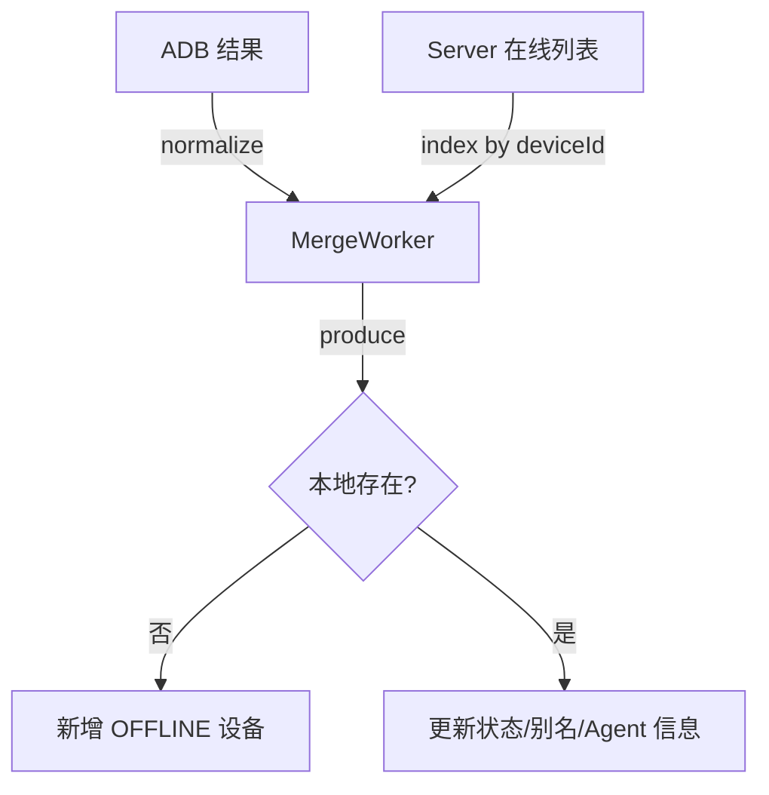

# 设备管理设计

NovaDesk 需在本地维护设备列表并与 Server 在线状态对齐。本地与云端不直接共享存储，通过 `pcId + deviceId` 关联。设备来源包括 USB 直连与通过 `adb connect` 建立的 Wi-Fi 连接，PC 端需同时管理两类连接并标明上线状态差异。

## 数据结构

```dart
class LocalDevice {
  final String deviceId;        // ADB serial
  final String? alias;          // 用户自定义别名（可选）
  final DeviceStatus status;    // OFFLINE / STARTING / ONLINE / STOPPING
  final bool serverOnline;      // 来自 Server 的在线标记
  final AgentInfo? agentInfo;   // Server 公布的 Agent 信息
}
```

- `status` 表示本地视角，`serverOnline` 表示云端视角。
- `AgentInfo` 含 `agentVersion`、`scriptCatalog`、`lastHeartbeat`、`currentExecution`。
- ADB 返回的 `product`/`model`/`device` 等属性会保存到快照中，用于在列表中展示设备型号与连接方式。
- 对于状态为 `device` 的终端，客户端会额外执行 `adb shell getprop ro.build.version.release` 与 `adb shell wm size`，以记录安卓版本与物理分辨率（列于表格“安卓版本”“屏幕尺寸”列）。

## 列表生成流程

1. `AdbService.listDevices()` 返回本地设备数组，附带连接类型（USB/Wi-Fi）、远程地址与额外属性。
2. REST `GET /api/devices` 返回云端在线设备集合。
3. `DeviceSyncCoordinator` 定时（默认 5s）触发合并任务，也可由 UI 手动刷新或 WS 事件增量触发。
4. 合并规则：
   - 若本地有设备但 Server 无，状态 `OFFLINE`，并标注“未上线 Server”提示用户执行上线。
   - 若双方都有且匹配 `pcId` → 状态 `ONLINE`；
   - 若 Server 有记录但 `pcId` 不匹配 → 提示“设备被其他 PC 占用”。
   - 若 Server 有记录但本地缺失 → 标记为 `REMOTE_ONLY`，指示云端在线需要检查本地连接。
5. 合并结果将在内存中直接替换，并通过 `DeviceEventBus` 发布 `DeviceSyncCompleted` 领域事件供 UI 更新。
6. UI 显示：
   - 在线状态（绿/灰）；
   - 连接方式（USB / Wi-Fi），Wi-Fi 设备展示 `ip:port`；
   - 当前任务（来自 `AgentInfo.currentExecution`）。
   - 表头字段统一为：`设备/名称`、`屏幕尺寸`、`安卓版本`、`连接方式`、`本地状态`、`云端状态`、`PC_ID`、`操作`，其中屏幕尺寸与安卓版本由 ADB `wm size`、`getprop ro.build.version.release` 补齐。

### 模块职责

- `AdbService`：封装对 `adb` 命令的调用，提供 `listDevices()`、`connectWifiDevice(host:port)`、`disconnectDevice(serial)` 等方法；在设备处于 `device` 状态时附加采集屏幕尺寸与安卓版本。
- `DeviceSyncCoordinator`：
 - 调度周期性拉取：`AdbService.listDevices()` + `DeviceApi.fetchOnlineDevices()`，合并后直接发布 `DeviceSyncCompleted` 事件。
  - Wi-Fi 连接/断开后立即执行一次同步，保证表格展示实时数据。
  - 若某设备同时在 ADB 与 Server 列表缺失，会在下一次同步中自动移除，避免历史“幽灵设备”留存。
  - ADB 返回状态为 `offline` 的设备会被忽略，避免无效条目干扰设备列表。
- `DeviceController`（应用层）：监听 `DeviceEventBus` 的同步事件，替换当前设备 Map，并向 UI 状态暴露最新的快照（事件包含 `changed` 与 `removedDeviceIds` 以供诊断）。

### 合并算法要点



- 所有设备以 `deviceId` 为主键，对 ADB 返回的重复/空白记录需过滤。
- 若本地 `status=STARTING`，Server 尚未返回上线事件，允许保留临时状态。
- Server 返回 `pcId` 不匹配时，设备标记为 `CONFLICT`，并在 UI 显示告警。
- Merge 完成后记录 `lastSyncedAt`，用于 UI 展示刷新时间。

## 上线操作

### 上线
1. 用户点击“上线” → 触发 `DeviceController.start(deviceId)`。
2. 控制器步骤：
   - 切换状态 `STARTING`；
   - 执行 `installAgent`（视版本情况）；
   - 构造启动参数 JSON，写入临时文件/`am start` 参数：
     ```json
     {
       "serverUrl": "https://api.example.com",
       "agentWs": "wss://api.example.com/ws/agent",
       "token": "<deviceToken>",
       "tenantId": "...",
       "userId": "...",
       "pcId": "PC-123",
       "deviceId": "emulator-5554"
     }
     ```
   - `adb shell am start -n <agentPackage>/<Runner> --es args '<json>'`
3. 监听 Server 推送的 `REGISTER` 成功事件，将状态改为 `ONLINE`。
4. 超时未上线 → 恢复为 `OFFLINE` 并提示错误日志。

> 上线前，NovaDesk 会调用 `GET /api/agent-packages/latest` 获取激活版本，自动下载（并校验 `SHA256`）至本地缓存；随后检查设备上的 `com.nova.agent` 是否存在且校验值一致，若缺失或版本不匹配，会自动执行 `adb install -r` 安装最新 APK。

> 当前桌面端未提供“下线/断开”按钮。如需断开，可在命令行执行 `adb shell am force-stop` 或调用 Server API `POST /api/devices/{deviceId}/stop`。

## 错误处理

- ADB 失败：捕获异常，展示错误消息，并恢复状态。
- Server 判定 `pcId` 不匹配：停止本地 Agent，提示用户关闭另一台 PC。
- Agent 心跳超时：Server 推送下线事件；UI 显示红色 ⚠ 提醒用户检查设备。
- 对于持续失败的 ADB 调用，`DeviceSyncCoordinator` 应指数退避，并在日志中写入最近错误，避免刷屏。
- 所有异常需归档到 `logs/app.log`，带上 `deviceId`、`pcId`、`action`。

## 多 PC 并行

- 每台 PC 维持独立设备列表。
- 当 Server 推送其他 PC 上线的同一 `deviceId`，当前 PC 应提示“占用中”。
- 若用户强制上线，可提供“夺取控制”功能：调用专门 API 断开旧连接并覆盖（需谨慎设计）。
